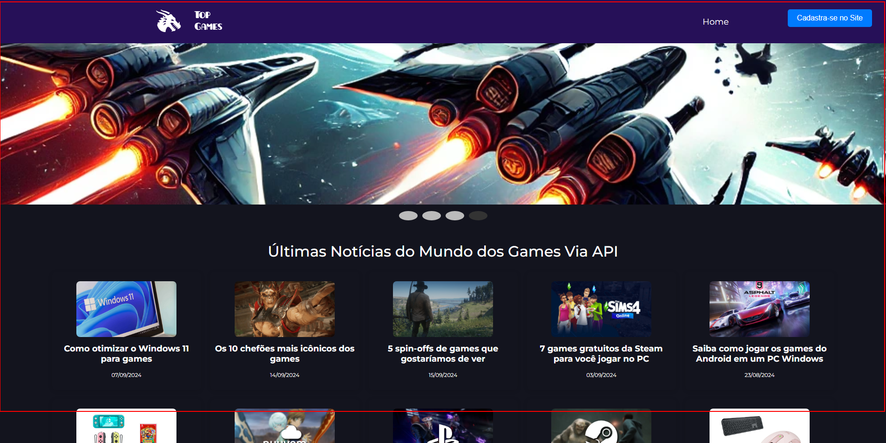
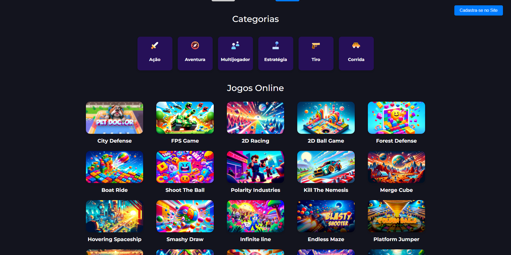
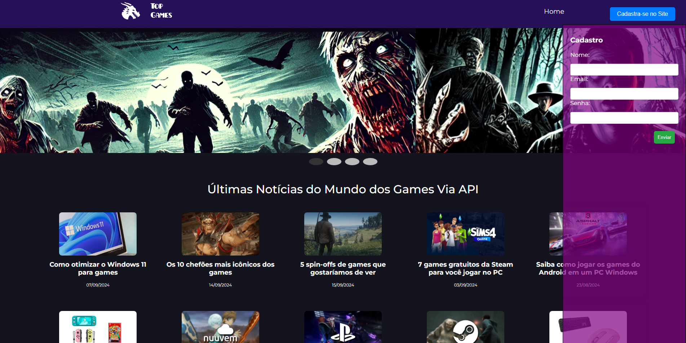
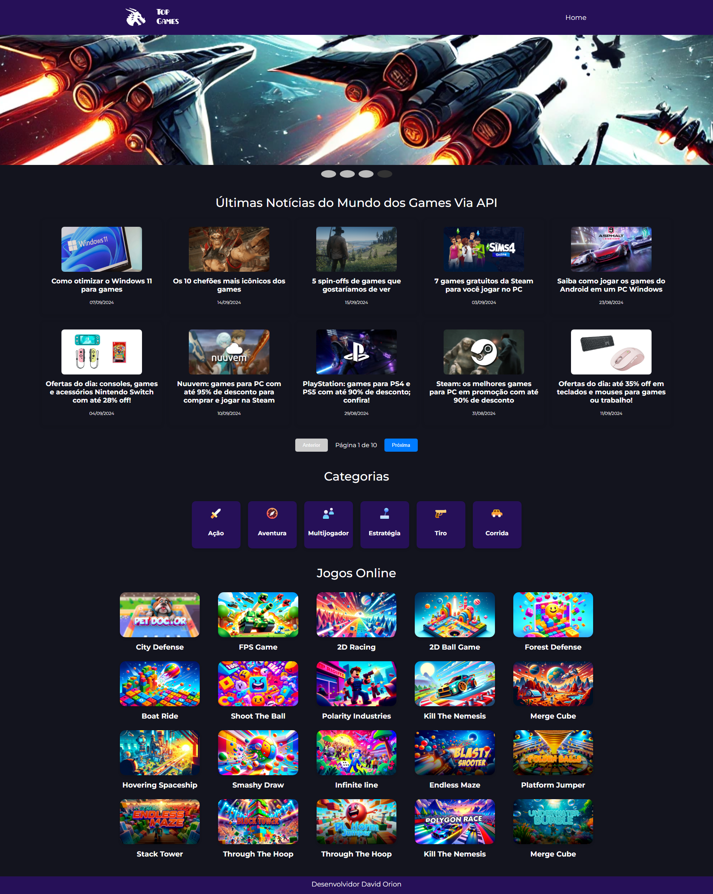

<h1 align="center">
<br>
  
<br>
<br>
🕹️ GameHub - Site de TOP GAMES feito em React Native 🎮
</h1>

<p align="center">
Bem-vindo ao GameHub, um site de notícias e informações sobre o mundo dos Games, desenvolvido em React Native. Este projeto foi criado para fornecer uma experiência dinâmica e interativa para gamers que desejam se manter atualizados sobre as últimas novidades, jogos e tendências da indústria dos games.</p>

<p align="center">
  <a href="#">
    
  </a>
</p>

<div align="center">

### Apresentação

<br>

### Categoria


  <br>

  ### Lateral

  <br>

   ### Inteira

  <br>
  
  <br> 

</div>

 
 ### 🔍 Visão Geral
```sh
 TOP GAMES é um aplicativo voltado para entusiastas de games, onde é possível:
Ver as últimas notícias do mundo dos games.
Explorar diferentes categorias de jogos.
Este projeto foi desenvolvido com o objetivo de explorar e demonstrar habilidades com React Native, integrando-se a APIs externas e criando uma interface amigável para dispositivos móveis. 

```


<hr />

## 🚀 Funcionalidades Principais

```sh
Notícias sobre Games: Últimas notícias do mundo dos games consumidas de APIs externas (ex: NewsAPI).
Catálogo de Jogos: Exibição de uma lista de jogos com imagens e vídeos.
Favoritos: Possibilidade de favoritar jogos e acessá-los rapidamente.
Filtro por Categorias: Navegação entre categorias de games.
Design Responsivo: Interface otimizada para diferentes tamanhos de tela.
 
```

🛠️ Tecnologias Utilizadas
```sh
Este projeto foi desenvolvido usando as seguintes tecnologias:

React Native - Framework principal para a criação da interface.
React Navigation - Para navegação entre páginas.
Axios - Para fazer requisições HTTP para APIs de notícias e jogos.
Context API - Para gerenciamento de estado global (como o sistema de favoritos e categorias).
CSS Modules - Para estilização customizada e modularizada dos componentes.
NewsAPI - API utilizada para obter as últimas notícias sobre games.
JSON Server (ou API própria) - Para simulação de um backend com os dados de jogos.
```

## 📧 Contato

Caso tenha alguma dúvida, entre em contato:

E-mail: david.foxmulder@gmail.com<br>
LinkedIn: [david orion](https://www.linkedin.com/in/davidmuldersilva/)


